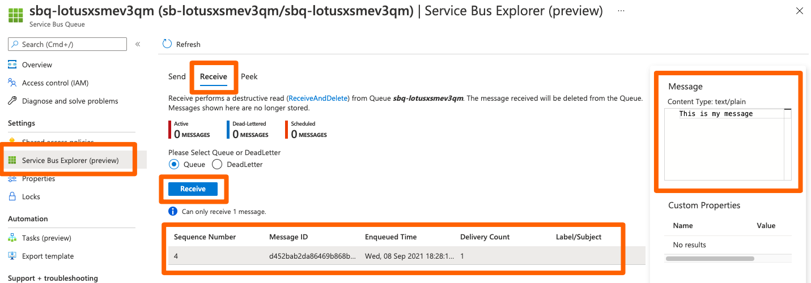

# Forward messages from AWS SQS to Azure Service Bus

This example demonstrates how to send messages from an SQS queue in AWS to a Service Bus queue in Azure by using a Logic App as the connection between the two queues.

## Prerequisites

- AWS CLI with a default profile and default region configured ([install](https://aws.amazon.com/cli/))
- Azure CLI with a default subscription set ([install](https://docs.microsoft.com/en-us/cli/azure/install-azure-cli))
- Azure Bicep CLI (install with `az bicep install`)

## Deploy AWS resources

Create an IAM user with access keys, and an SQS queue. If you already have a user and a queue you want to test with use them instead, but you need to provide the access keys and the queue URL to the Azure deployment yourself.

```bash
stackName=aws-sqs-to-azure-servicebus
aws cloudformation deploy \
    --stack-name $stackName \
    --template-file ./aws/deployment.yml \
    --capabilities CAPABILITY_IAM

sqsUrl=$(aws cloudformation describe-stacks \
    --stack-name $stackName \
    --query 'Stacks[].Outputs[?OutputKey==`SqsQueueUrl`].OutputValue' \
    --output text)

accessKeyId=$(aws cloudformation describe-stacks \
    --stack-name $stackName \
    --query 'Stacks[].Outputs[?OutputKey==`AccessKeyId`].OutputValue' \
    --output text)

secretAccessKey=$(aws cloudformation describe-stacks \
    --stack-name $stackName \
    --query 'Stacks[].Outputs[?OutputKey==`SecretAccessKey`].OutputValue' \
    --output text)
```

## Deploy Azure resources

Create a resource group, a service bus namespace and queue, and a logic app with the required connections for SQS and Service Bus.

```bash
deploymentName=aws-sqs-to-azure-service-bus
az deployment sub create \
    --name $deploymentName \
    --location northeurope \
    --template-file ./azure/main.bicep \
    --parameters sqsQueueUrl=$sqsUrl awsAccessKeyId=$accessKeyId awsSecretAccessKey=$secretAccessKey
```

## Test

### Send a message to the SQS queue

Use the AWS CLI to send a message to the queue.

```bash
aws sqs send-message --queue-url $sqsUrl --message-body "This is my message"
```

### Verify that the message has arrived in Service Bus queue

Use the Azure portal to verify that the message is received in the Service Bus queue.

1. Go to the [Azure portal](https://portal.azure.com/)
1. Open your Service Bus namespace
1. Click on _queues_ and open the only queue in the list
1. Open the _Service Bus Explorer (preview)_ blade for the queue
1. Click on the _Receive_ tab and then on the _Receive_ button
1. Confirm that you want to perform the destructive action by clicking _Yes_
1. The message is displayed on the bottom of the page, click on it to see the message content



## Delete resources

Delete AWS resources.

```bash
aws cloudformation delete-stack --stack-name $stackName
```

Delete Azure resources. Note that there seems to be a delay of several minutes before the Azure subscription registers the deployment metadata. This means the first command below will not return the resource group name until this happens.

```bash
resourceGroupName=$(az deployment sub show \
    --name $deploymentName \
    --query 'properties.outputs.resourceGroupName.value' \
    --output tsv)
az group delete --name $resourceGroupName --yes --no-wait
```
